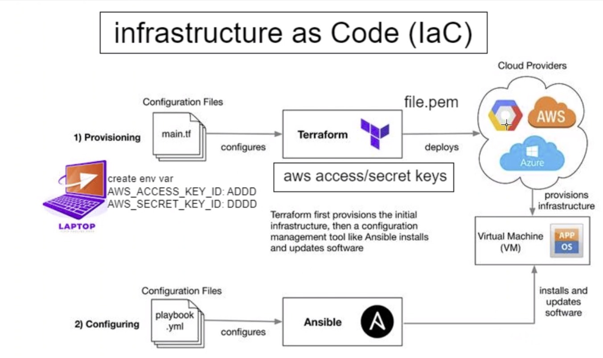

# Terraform: A Comprehensive Guide

Terraform, an open-source Infrastructure as Code (IaC) tool developed by HashiCorp, is a powerful tool that allows users to define and manage infrastructure resources. It's cloud-independent, meaning it can be used on any cloud, local, or hybrid environments, unlike AWS cloud formation, which is cloud-dependent and can only be used on AWS.

## Understanding Terraform

Terraform enables users to describe their desired infrastructure state in code, and it takes care of provisioning and managing the resources to match that state. It manages a wide range of resources, including virtual machines, networks, storage, and more, using a declarative configuration language.

## Key Advantages of Using Terraform

1. **Infrastructure as Code (IaC):** The core benefit of Terraform lies in its ability to treat infrastructure as code. It uses human-readable configuration files, making infrastructure versionable, maintainable, and collaborative. This approach ensures consistency and repeatability in infrastructure provisioning and management.

2. **Declarative Configuration:** Terraform employs a declarative approach, where you define the desired state of your infrastructure instead of writing procedural scripts. This approach simplifies the understanding, management, and modification of infrastructure configurations.

3. **Multi-Cloud and Multi-Provider Support:** Terraform is compatible with various cloud providers (like AWS, Azure, Google Cloud Platform) and on-premises infrastructure. This compatibility allows users to manage resources across multiple cloud providers while maintaining a consistent deployment workflow.

4. **Dependency Management and Resource Graph:** Terraform automatically handles resource dependencies and creates a dependency graph. This feature ensures resources are provisioned in the correct order, minimizing the risk of errors and ensuring efficient infrastructure creation.

5. **Change Management and Planning:** Terraform provides a preview of the changes it will apply before executing them. This feature enables users to review and validate proposed changes, reducing the likelihood of unexpected disruptions in the infrastructure.

6. **State Management:** Terraform tracks the state of the managed infrastructure in a state file. This state file is crucial for tracking changes and performing updates or modifications to the infrastructure.

## How to Download Terraform on Windows

Follow the steps below to download and install Terraform on your Windows system:

### Download Terraform

1. Visit the official [Terraform Downloads](https://www.terraform.io/downloads.html) page.
2. Download the Windows 64-bit version of Terraform. The file is usually a zip archive.

### Extract the Archive

3. Once the download is complete, locate the downloaded zip archive.
4. Right-click on the zip file and select "Extract All..." to extract its contents to a folder of your choice. You can use the built-in Windows extraction tool or a third-party file archiver like 7-Zip.

### Add Terraform to System Path

To use Terraform from any directory on the command prompt, you need to add the folder containing the Terraform executable to your system's PATH environment variable. Here's how you can do it:

5. Open the Start menu and search for "Environment Variables."
6. Select "Edit the system environment variables."
7. Click the "Environment Variables..." button.
8. In the System Variables section, scroll down and find the "Path" variable. Click "Edit."
9. Click "New," and then add the path to the folder where you extracted the Terraform executable. For example: `C:\Users\ZainA\terraform_1.5.3_windows_amd64`.

### Verify Installation

10. Open a new Command Prompt (or PowerShell) window.
11. Type `terraform --version` and press Enter.
12. If Terraform is correctly installed and added to the system PATH, it will display the version information.
    

# Terraform Workflow

Terraform is utilized to specify and set up the necessary infrastructure resources in your chosen cloud provider (like AWS, Azure, GCP) through Terraform configuration files. Terraform makes sure that the infrastructure is established and adjusted according to the provided specifications.

# Ansible Workflow

After Terraform has provisioned the infrastructure, Ansible playbooks can be used to adjust and manage the software and settings on the created resources. Ansible links to the servers and carries out the tasks outlined in the playbooks to ensure the configurations are implemented as desired.

# Terraform and Its Benefits:

## What is Terraform?

- Terraform is an open-source infrastructure as code (IaC) tool developed by HashiCorp.
- It allows users to define and manage infrastructure resources, such as virtual machines, networks, storage, and more, in a declarative manner using configuration files.
- Terraform follows a "desired state" approach, where users define the desired configuration, and Terraform takes care of bringing the actual infrastructure into that desired state.
- It supports various cloud providers, including AWS, Azure, Google Cloud Platform, and others, as well as on-premises infrastructure and other services like DNS providers.

## Benefits of Using Terraform for a Business:

1. **Consistency and Standardization**: Terraform ensures that the infrastructure is deployed consistently and according to predefined standards, reducing the risk of errors and inconsistencies.

2. **Scalability**: With Terraform, businesses can easily scale their infrastructure up or down as needed, adapting to changing demands and workloads efficiently.

3. **Version Control**: Terraform configuration files can be version-controlled, enabling teams to collaborate effectively and track changes over time.

4. **Automation**: By using Terraform, businesses can automate the provisioning and management of infrastructure, which reduces manual intervention, saves time, and minimizes human errors.

5. **Cost Management**: Terraform helps optimize costs by allowing businesses to visualize the infrastructure changes before applying them, thus avoiding unnecessary expenses.

6. **Fast and Reliable Deployment**: Terraform automates the deployment process, leading to faster and more reliable infrastructure setup and updates.

7. **Multi-Cloud and Hybrid Cloud Support**: Terraform's multi-cloud support allows businesses to adopt a multi-cloud or hybrid cloud strategy without the need to learn different tools for each cloud provider.

8. **Auditing and Compliance**: The declarative nature of Terraform allows businesses to audit and track the entire infrastructure, ensuring compliance with security and regulatory requirements.

9. **Infrastructure as Code**: By using IaC principles, businesses can treat infrastructure as software, enabling versioning, code review, and the ability to roll back changes when necessary.

10. **Collaboration and Modularity**: Terraform modules promote code reusability, making it easier for teams to collaborate and share best practices across projects.

---

# Setting AWS Credentials on Windows 10:

1. On the Windows taskbar, right-click the Windows icon and select "System."
2. In the Settings window, under "Related Settings," click "Advanced system settings."

3. On the "Advanced" tab, click "Environment Variables."

4. In the "Environment Variables" dialog, click "New" to create a new environment variable for the AWS Access Key. If you already have a variable named "AWS_ACCESS_KEY_ID," click "Edit" to modify it.
5. Set the variable name as "AWS_ACCESS_KEY_ID" and the value as your AWS Access Key ID provided by AWS.
6. Click "OK" to save the new environment variable.
7. Now, click "New" again to create a new environment variable for the AWS Secret Access Key. If you already have a variable named "AWS_SECRET_ACCESS_KEY," click "Edit" to modify it.
8. Set the variable name as "AWS_SECRET_ACCESS_KEY" and the value as your AWS Secret Access Key provided by AWS.
9. Click "OK" to save the new environment variable.
10. After creating or modifying both environment variables, click "Apply" and then "OK" in the "Environment Variables" dialog to have the changes take effect.

---

# `main.tf` Code:

```terraform
# launch an ec2

# which cloud - aws

# terraform download required dependencies

# terraform init

# provider name
provider "aws" {
  # which part of this aws
  region = "eu-west-1"
}

# Launch an ec2 in Ireland
resource "aws_instance" "app_instance" {
  # which machine/OS version etc. AMI-id ubuntu 18.04LTS
  ami = "<ami-id></ami-id>"

  # what type of instance
  instance_type = "t2.micro"

  # is the public IP required
  associate_public_ip_address = true

  # what would you like to name it tech241-zain-terraform-app
  tags = {
    Name = "tech241-zain-terraform-app"
  }
}
```

# Explanation:

The `main.tf` file contains Terraform configuration code written in HashiCorp Configuration Language (HCL).
The code launches an EC2 (Elastic Compute Cloud) instance on AWS (Amazon Web Services) in the `eu-west-1` region (Ireland).
The `provider` block specifies the AWS provider and sets the region to `eu-west-1`.
The `resource` block defines the resource type `aws_instance`, creating an EC2 instance with the specified properties.
The `ami` attribute specifies the Amazon Machine Image ID, which is used to identify the OS and other settings for the instance (Ubuntu 18.04 LTS in this case).
The `instance_type` attribute defines the EC2 instance type (`t2.micro`).
The `associate_public_ip_address` attribute is set to `true`, which means the EC2 instance will have a public IP address assigned.
The `tags` attribute is used to assign metadata to the instance, and here it sets the Name tag to "tech241-zain-terraform-app".

## Terraform Commands:

### Terraform Plan:

- The `terraform plan` command is used to create an execution plan that shows what actions Terraform will take to achieve the desired state specified in the configuration files.
- It analyzes the configuration and compares it with the existing infrastructure to determine any changes required to reach the desired state.
- This command helps identify any potential issues or unintended changes before actually applying the changes.

### Terraform Apply:

- The `terraform apply` command is used to apply the changes and create or modify the infrastructure as defined in the configuration files.
- Once executed, Terraform will create or update resources based on the desired state specified in the configuration.
- It will prompt for confirmation before proceeding with the changes. You can use the `-auto-approve` flag to skip the confirmation prompt in automated scripts.

### Terraform Destroy:

- The `terraform destroy` command is used to destroy the infrastructure created by Terraform in the configuration files.
- When executed, Terraform will delete all the resources defined in the configuration, effectively tearing down the infrastructure.
- Similar to `apply`, it will prompt for confirmation before proceeding, and you can use the `-auto-approve` flag to skip the confirmation prompt in automated scripts.
